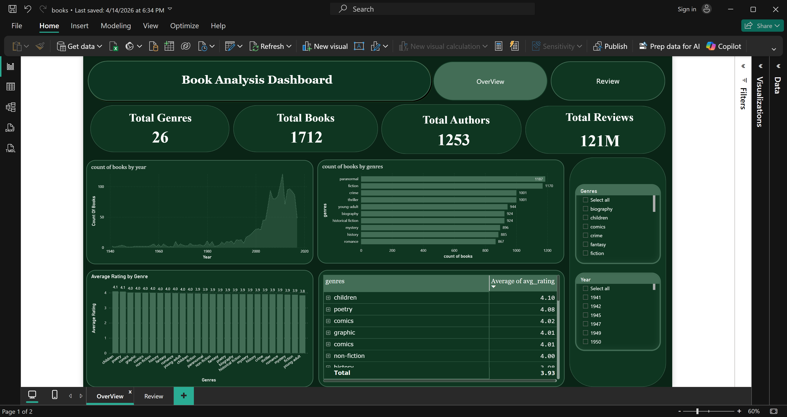
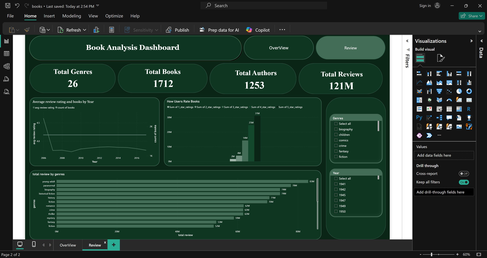

# 📚 Book Insights Dashboard

An interactive Power BI dashboard analyzing Goodreads books data to uncover reading trends, genre popularity, and reader rating behavior.

--------------------------------------------------------------------------------------------------

# 📌 Project Overview

This project explores how readers choose books and how different genres perform based on ratings and popularity.

The dashboard provides insights into:
- Popular book genres
- Reader rating behavior
- Publishing trends over time
- Highly recommended books
- Genre performance comparison

--------------------------------------------------------------------------------------------------

# 🎯 Project Goals

- Analyze reader preferences across genres
- Identify top-rated and most popular books
- Explore publishing trends over time
- Understand rating distribution from 1⭐ to 5⭐
- Compare genre performance based on ratings

--------------------------------------------------------------------------------------------------

# 🛠️ Tools Used

- Power BI
- Power Query
- DAX
- Data Cleaning
- Data Visualization

--------------------------------------------------------------------------------------------------

# 📂 Dashboard Features

## 📖 Genre Analysis
Explores the most popular and highest-rated book genres.

### Includes:
- Most popular genres
- Highest-rated genres
- Genre comparison analysis

### Key Insight:
Some genres consistently receive higher ratings regardless of publishing trends.

--------------------------------------------------------------------------------------------------

## ⭐ Rating Analysis
Analyzes how readers rate books over time.

### Includes:
- Rating distribution (1⭐ to 5⭐)
- Average rating trends
- Reader behavior analysis

### Key Insight:
Reader ratings remain relatively stable over time even as the number of published books changes.

--------------------------------------------------------------------------------------------------

## 📈 Publishing Trends
Tracks book publishing activity across years.

### Includes:
- Number of published books by year
- Growth trends in publishing
- Publishing activity comparison

### Key Insight:
The number of books published changes significantly over time while average ratings remain consistent.

--------------------------------------------------------------------------------------------------

## 🏆 Top Recommended Books
Highlights the best-performing and most recommended books.

### Includes:
- Top-rated books
- Most recommended titles
- Reader favorites

--------------------------------------------------------------------------------------------------

# 📷 Dashboard Preview

--------------------------------------------------------------------------------------------------
# 📊 Key Insights

- Reader ratings stay relatively stable over time
- Publishing volume changes but ratings remain consistent
- Some genres consistently achieve higher ratings
- Popular genres attract more reader engagement

--------------------------------------------------------------------------------------------------

By
Mohamed Ashraf  
Data Analyst | Power BI Enthusiast

